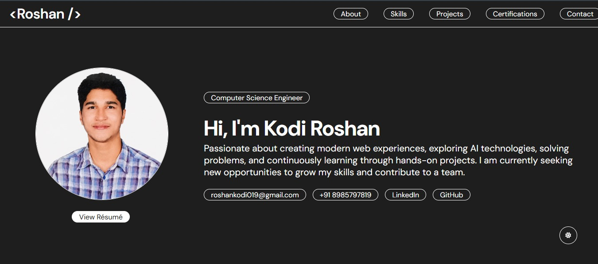

# 🌐 Portfolio Website

A modern and responsive personal portfolio website built with **React.js** and deployed using **GitHub Pages**. This portfolio showcases my projects, technical skills, certifications, and contact information in a clean and interactive interface.

## 🚀 Live Demo

🔗 ## 🚀 Live Demo

🔗 https://roshankodi.github.io/portfolio-me/

---

# ✨ Features

* Responsive modern UI
* Smooth navigation and clean layout
* Skills section
* Projects showcase
* Certifications section
* Resume download button
* GitHub & LinkedIn integration
* Dark mode support
* GitHub Pages deployment

---

# 🛠️ Tech Stack

### Frontend

* React.js
* JavaScript
* HTML5
* CSS3

### Tools & Platforms

* Git
* GitHub
* VS Code
* GitHub Pages
* Vercel

### Cloud & Technologies

* AWS
* Google Cloud
* Netlify

---

# 📂 Project Structure

```bash
portfolio-me/
├── public/
├── src/
│   ├── Components/
│   ├── Assets/
│   ├── App.js
│   └── index.js
├── package.json
└── README.md
```

---

# ⚙️ Installation & Setup

Clone the repository:

```bash
git clone https://github.com/roshankodi/portfolio-me.git
```

Move into project directory:

```bash
cd portfolio-me
```

Install dependencies:

```bash
npm install
```

Run locally:

```bash
npm start
```

---

# 🚀 Deployment

This project is deployed using GitHub Pages.

Deploy command:

```bash
npm run deploy
```

---

# 📸 Screenshots

## Home Page



---

# 📄 Resume

You can download my resume directly from the portfolio website.

---

# 📬 Contact

### 👨‍💻 Roshan Kodi

* 📧 Email: [roshankodi19@gmail.com](mailto:roshankodi19@gmail.com)
* 💼 LinkedIn: [https://www.linkedin.com/](https://www.linkedin.com/)
* 🐙 GitHub: [https://github.com/meow-1010](https://github.com/meow-1010)

---

# 🌱 Future Improvements

* Add more real-world projects
* Improve animations and transitions
* Add backend integration
* Add blog section
* Improve accessibility and SEO
* Add project filtering and search

---

# ⭐ Support

If you like this project, consider giving it a star on GitHub.

---

# 📜 License

This project is open-source and available under the MIT License.
