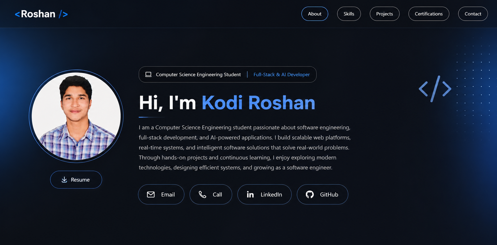

# 🌐 Personal Portfolio Website

Modern responsive developer portfolio built with React.js showcasing projects, certifications, skills, achievements and downloadable resume support with clean UI/UX. The portfolio serves as a central place to highlight my work, learning journey, and professional profile.

## 🚀 Live Demo

🔗 Portfolio Website: https://roshankodi.github.io/portfolio-me/

---

### 📄 Resume

🔗 Resume: https://roshankodi.github.io/portfolio-me/resume.pdf

---

## ✨ Highlights

- Modern and responsive UI
- Interactive and clean user experience
- Professional project showcase
- Technical skills categorization
- Certification portfolio with PDF access
- Resume integration
- GitHub & LinkedIn integration
- Mobile-first responsive design
- Dark mode support
- GitHub Pages deployment

---

### Technologies Featured

- React.js
- JavaScript
- HTML5
- CSS3
- Git & GitHub
- GitHub Pages
- Responsive Design
- REST APIs
- AI & Machine Learning Projects
- Full-Stack Development

---

## 📂 Project Structure

```bash
portfolio-me/
│
├── public/
│   ├── resume.pdf
│   └── images/
│
├── src/
│   ├── Assets/
│   ├── Components/
│   ├── App.js
│   └── index.js
│
├── package.json
├── README.md
└── .gitignore
```

---

## ⚙️ Installation & Setup

Clone the repository:

```bash
git clone https://github.com/roshankodi/portfolio-me.git
```

Move into the project directory:

```bash
cd portfolio-me
```

Install dependencies:

```bash
npm install
```

Start development server:

```bash
npm start
```

Open:

```bash
http://localhost:3000
```

---

## 🚀 Deployment

This project is deployed using GitHub Pages.

Deploy manually:

```bash
npm run deploy
```

---

## 📸 Screenshots

### Home Page



---

## 📬 Contact

### Kodi Roshan

📧 Email: roshankodi019@gmail.com

💼 LinkedIn:
https://www.linkedin.com/in/kodi-roshan/

🐙 GitHub:
https://github.com/roshankodi

---

## 🌱 Future Improvements

- Add more full-stack and AI projects
- Showcase internship and professional experience
- Integrate LinkedIn certificate posts
- Add project filtering and search
- Improve accessibility and SEO
- Add technical blog/articles section
- Add project analytics dashboard

---

## ⭐ Support

If you found this project useful, consider giving it a star.

---

## 📜 License

This project is available under the MIT License.